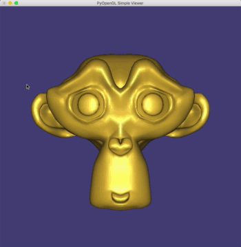

# simple-meshviewer
PyOpenGL based simple mesh viewer.  
Note: My implementation of Nelson's method which is using for vertex normal having bugs....

<div align="center">
  
  <div style="text-align: center;">
    Figure1. Overview of this repo
  </div>
</div>


## Environment
Ubuntu 18.04  
Python3.6


## Dependency

+ PyOpenGL
+ sys
+ os
+ PIL
+ datetime


## Usage
```
$ python main.py argvs[1]

    argvs[1] : path to mash (.obj)

  (option) --> default is 'gold'
    argvs[2] : registered materials index
             --> see figure2

*/----------------------------- manual -----------------------------/*
  Drag with Left Mousebutton   :  move eye position
  Drag with right Mousebutton  :  move down/up to zoom in/out
  Drag with middle Mousebutton :  move vertical/horizontal to
                                  translate the screen along y/x axis
           a / A               :  type a/A to turn on/off axis 
           w / W               :  type w/W to turn on/off wireframe
           s / S               :  type s/S to change Smooth/Flat shading
             r                 :  reset viewport
             p                 :  take a screenshot as .png
             q                 :  quit the program
*/------------------------------------------------------------------/*

```

<div align="center">
  
  <div style="text-align: center;">
    Figure2. List of registered materials
  </div>
</div>
